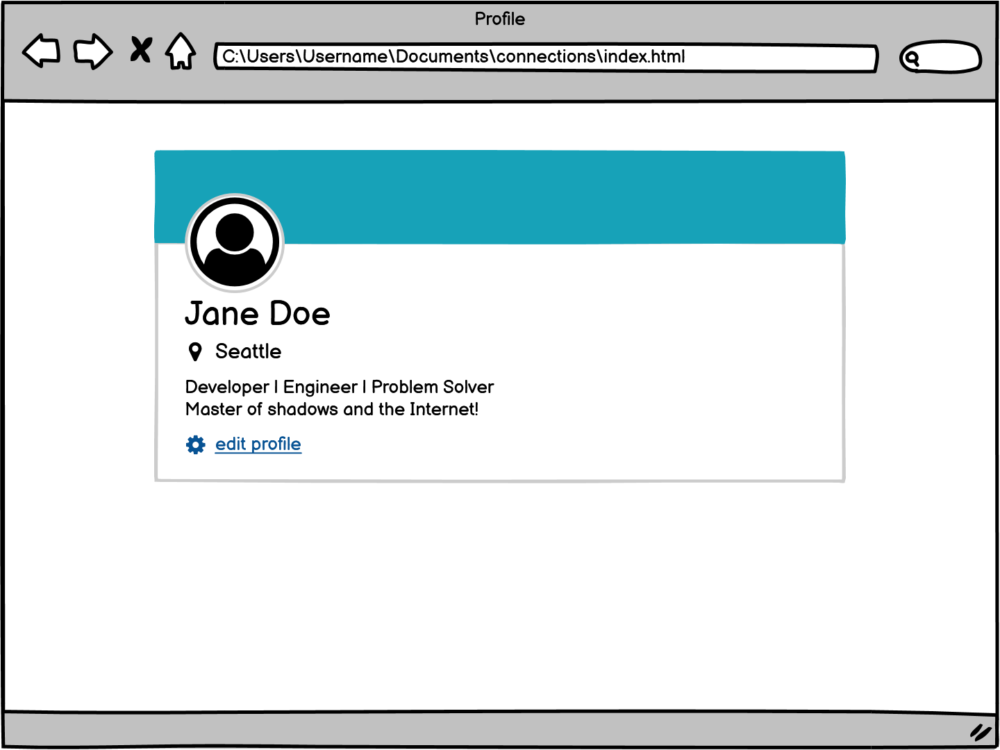
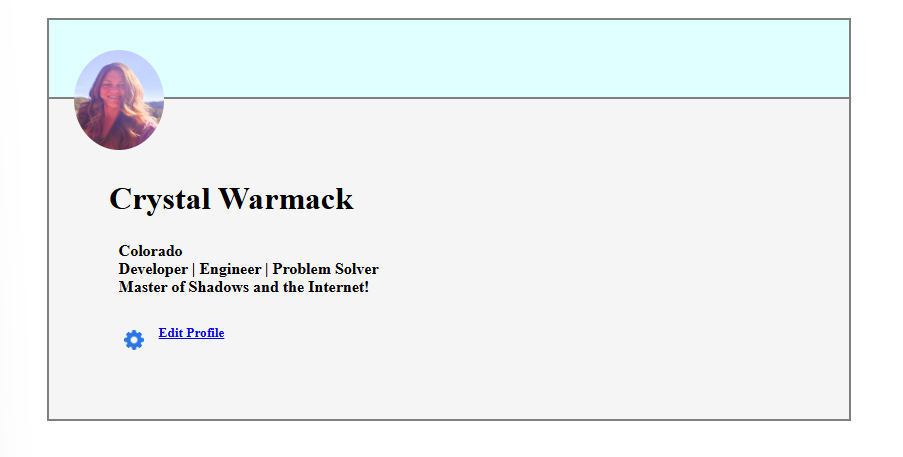

# User Card

#### Objectives
- Use what we've learned about **CSS** to recreate this layout

We can find any icons needed here.
- D:\coding_dojo\Web Fundamentals - Stack 1\Practice Assignments\8. user_card

- [x] Use CSS to recreate the above image

- [x] Use position to properly set the icon image as show above

Here is how mine turned out.

